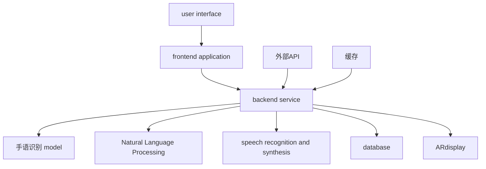
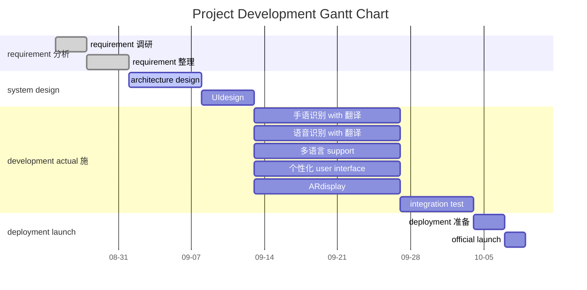

<div class="plan-header">

# 🚀 AIgenerated development plan

<div class="meta-info">

**⏰ generation time ：** 2025-08-21 10:37:38  
**🤖 AImodel ：** Qwen2.5-72B-Instruct  
**💡 基于 user 创意 intelligent 分析 generate**  
**🔗 AgentapplicationMCPservice enhanced**

</div>

</div>

---

# HandVoice Development Plan

## Product Overview

**project name 称**：HandVoice

**Project Goals**：development 一款enhanced现实（AR）application程序，能够实时将手语翻译成语音和文字，同时也能将语音和文字翻译成手语，以手势形式展示。HandVoice的core function包括实时手语识别 with 翻译、多语言 support、个性化 user interface和高精度的手势识别技术。该application旨in帮助聋哑人和听力正常人之间的沟通更加顺畅，减少误解，提高社会融合度。目标 user包括聋哑人、手语学习者、教师、医疗工作者等。use 场景广泛，如教育、医疗、公共service、家庭交流等。

**key 技术**：
- deep learning 手语识别 model
- Natural Language Processing 技术
- ARdisplay 技术

## Technical Solution

### tech stack

| tech stack | description |
|--------|------|
| **frontend** | React Native（跨平台开发） |
| **backend** | Node.js + Express |
| **database** | MongoDB |
| **machine learning** | TensorFlow（手语识别 model） |
| **Natural Language Processing** | spaCy |
| **ARdisplay** | ARKit（iOS） / ARCore（Android） |
| **speech recognition and synthesis** | Google Cloud Speech-to-Text / Text-to-Speech |
| **cloud service** | AWS |

### architecture diagram



### function module


**1. 手语识别 with 翻译**


**2. 语音识别 with 翻译**


**3. 多语言 support**


**4. 个性化 user interface**


**5. ARdisplay**


### tech stack to 比

| tech stack | 优点 | 缺点 |
|--------|------|------|
| **frontend** | React Native | 跨平台开发，代码复用率高 | 学习曲线较陡，某些原生功能需要额外开发 |
| **backend** | Node.js + Express | 轻量级，开发速度快 | 可能存in性能瓶颈，需要optimize |
| **database** | MongoDB | 灵活，support动态数据结构 | 查询性能不如关系型database |
| **machine learning** | TensorFlow | 生态丰富，社区support好 | 需要强大计算资源 |
| **Natural Language Processing** | spaCy | 功能强大，易于use | model较大，deployment成本高 |
| **ARdisplay** | ARKit / ARCore | 平台原生support，性能好 | 需要针 to不同平台进行适配 |
| **speech recognition and synthesis** | Google Cloud Speech-to-Text / Text-to-Speech | 高精度，support多语言 | 需要网络连接，成本较高 |
| **cloud service** | AWS | 稳定，可扩展性强 | 成本较高，需要专业运维 |

## Development Plan

### project when time 表



### project 里程碑

| 里程碑 | 日期 | description |
|--------|------|------|
| requirement 调研 complete | 2025-08-28 | 完成用户requirement 调研和整理 |
| system design complete | 2025-09-11 | 完成系统架构和UIdesign |
| 手语识别 with 翻译 development complete | 2025-09-25 | 完成手语识别 with 翻译功能开发 |
| 语音识别 with 翻译 development complete | 2025-09-25 | 完成语音识别 with 翻译功能开发 |
| 多语言 support development complete | 2025-09-25 | 完成多语言 support功能开发 |
| 个性化 user interface development complete | 2025-09-25 | 完成个性化 user interface功能开发 |
| ARdisplay development complete | 2025-09-25 | 完成ARdisplay功能开发 |
| integration test complete | 2025-10-02 | 完成所有功能的integration test |
| deployment 准备 complete | 2025-10-05 | 完成deployment前的准备工作 |
| official launch | 2025-10-07 | 项目official launch |

### deployment plan


**1. frontend application**：

   - useReact Native打包generateiOS和Androidapplication
   - 发布 toApp Store和Google Play


**2. backend service**：

   - useNode.js + Expressdeployment到AWS EC2
   - configuration 负载均衡 and 自动 extension


**3. database**：

   - useMongoDB Atlas作为云端database
   - configuration 备份 and 恢复策略


**4. machine learning model**：

   - useTensorFlow Servingdeployment手语识别 model
   - configuration model version 管理


**5. ARdisplay**：

   - useARKit和ARCore分别iniOS和Android上implementationARdisplay
   - ensureARdisplay的稳定性和性能

### promotion strategy


**1. 市场调研**：

   - 解目标 user requirement and use 场景
   - 收集 user 反馈， continuously optimize 产品


**2. 合作伙伴**：

   - Establish partnerships with deaf organizations, sign language learning institutions, hospitals, etc.
   - 通过合作伙伴进行产品推广 and user 培训


**3. 媒体宣传**：

   - 制作产品宣传视频，发布 to 社交媒体 and 视频平台
   - 参加行业展会 and 技术论坛，展示产品 function and 优势


**4. user 培训**：

   - 提供 detailed user 手册 and online 教程
   - 举办 line 上 and line 下培训活动，帮助 user 快速上手


**5. user experience**：

   - 设立 user experience in 心，收集 user 反馈
   - continuously optimize user experience ， improve user satisfaction

#

---


<div class="prompts-highlight">

# 🤖 AIAI Programming Assistant Prompts

> 💡 **Usage Instructions**：以下prompt词基于您的项目需求定制generate，可直接复制到 GitHub Copilot、ChatGPT、Claude 等AI编程tool中use


### 手语识别 with 翻译 development prompt


```
PleaseHandVoice开发手语识别 with 翻译功能。

Project Background:
HandVoiceis an Augmented Reality (AR）application程序，旨in帮助聋哑人和听力正常人之间的沟通更加顺畅。手语识别 with 翻译功能是core function之一，需要能够实时将手语翻译成语音和文字。

Functional Requirements:
1. implement real-time 手语识别， can 够准确识别手语手势
2. will 手语手势翻译成语音 and 文字
3. Support multiple sign languages (such as American Sign Language, British Sign Language, etc.)
4. optimize 识别速度 and 准确率

Technical Constraints:
- useTensorFlow进行手语识别 model的训练和deployment
- ensure model in 移动端 performance and 稳定性
- integrate intoReact Nativefrontend application中

Output Requirements:
- complete runnable code
- detailed annotation description
- error handling mechanism
- test case
```


### 语音识别 with 翻译 development prompt


```
PleaseHandVoice开发语音识别 with 翻译功能。

Project Background:
HandVoiceis an Augmented Reality (AR）application程序，旨in帮助聋哑人和听力正常人之间的沟通更加顺畅。语音识别 with 翻译功能是core function之一，需要能够实时将语音翻译成手语和文字。

Functional Requirements:
1. implement real-time 语音识别， can 够准确识别语音 content
2. will 语音 content 翻译成手语 and 文字
3. Support multiple languages (such as English, Chinese, Spanish, etc.)
4. optimize 识别速度 and 准确率

Technical Constraints:
- useGoogle Cloud Speech-to-Text进行语音识别
- useGoogle Cloud Text-to-Speech进行语音合成
- ensure in 移动端 performance and 稳定性
- integrate intoReact Nativefrontend application中

Output Requirements:
- complete runnable code
- detailed annotation description
- error handling mechanism
- test case
```


### 多语言 support development prompt


```
PleaseHandVoice开发多语言 support功能。

Project Background:
HandVoiceis an Augmented Reality (AR）application程序，旨in帮助聋哑人和听力正常人之间的沟通更加顺畅。多语言 support功能是重要功能之一，需要能够support多种语言的输入和输出。

Functional Requirements:
1. Support multiple language input (such as English, Chinese, Spanish, etc.)
2. support 多种语言 output （文字 and 语音）
3. 提供语言切换 function ， user can with 自 by select input and output 语言
4. optimize 多语言 process performance and 准确率

Technical Constraints:
- useGoogle Cloud Translation API进行多语言翻译
- ensure in 移动端 performance and 稳定性
- integrate intoReact Nativefrontend application中

Output Requirements:
- complete runnable code
- detailed annotation description
- error handling mechanism
- test case
```


### 个性化 user interface development prompt


```
PleaseHandVoice开发个性化 user interface功能。

Project Background:
HandVoiceis an Augmented Reality (AR）application程序，旨in帮助聋哑人和听力正常人之间的沟通更加顺畅。个性化 user interface功能是提升user experience的重要部分，需要能够根据用户的偏好和需求进行个性化configuration。

Functional Requirements:
1. 提供多种主题 and 样式供 user select
2. support user 自 definition interface 布局
3. Provide personalized setting options, such as font size, color, etc.
4. optimize user interface can 用性 and 美观性

Technical Constraints:
- useReact Native进行frontend development
- ensure interface response should 速度 and 稳定性
- integrate intoReact Nativefrontend application中

Output Requirements:
- complete runnable code
- detailed annotation description
- error handling mechanism
- test case
```


### ARdisplay development prompt


```
PleaseHandVoice开发ARdisplay功能。

Project Background:
HandVoiceis an Augmented Reality (AR）application程序，旨in帮助聋哑人和听力正常人之间的沟通更加顺畅。ARdisplay功能是core function之一，需要能够将手语手势以AR形式展示。

Functional Requirements:
1. implement real-timeARdisplay，能够将手语手势以AR形式展示
2. support 多种手势ARdisplay
3. optimizeARdisplay的性能和稳定性
4. ensure in not 同设备上兼容性

Technical Constraints:
- useARKit进行iOS端的ARdisplay
- useARCore进行Android端的ARdisplay
- ensure in 移动端 performance and 稳定性
- integrate intoReact Nativefrontend application中

Output Requirements:
- complete runnable code
- detailed annotation description
- error handling mechanism
- test case
```


The above isHandVoice项目的详细Development Plan和AIAI Programming Assistant Prompts。希望这些content能够帮助项目顺利进行。

</div>
